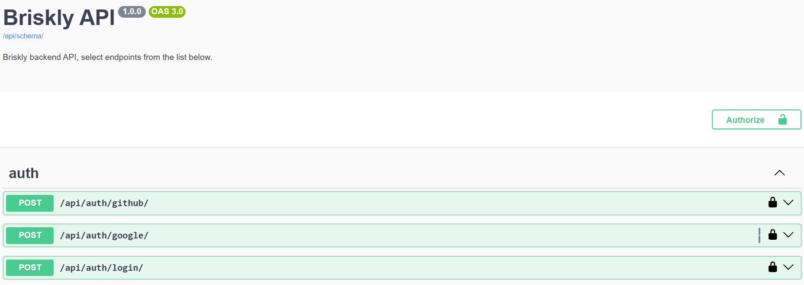
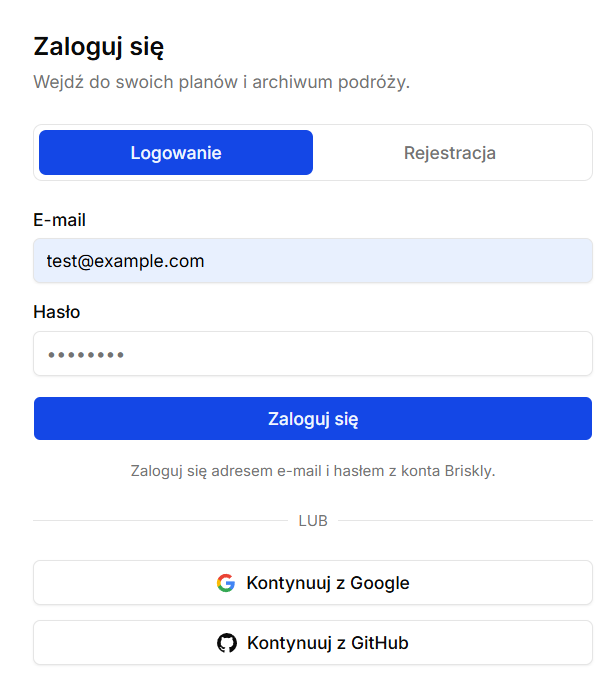
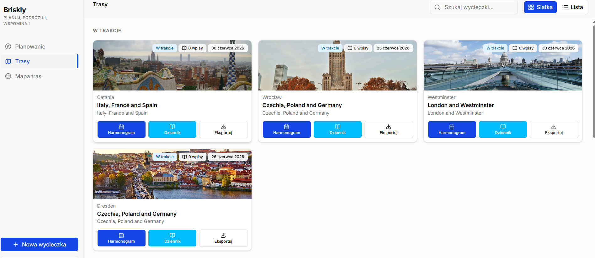
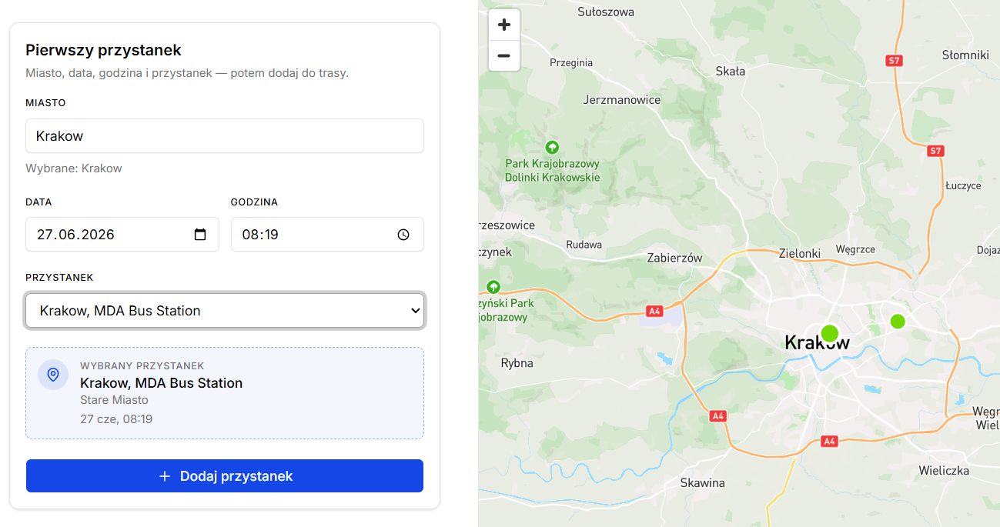
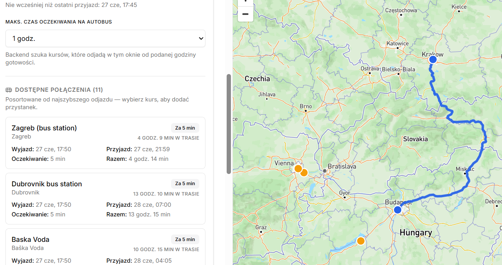
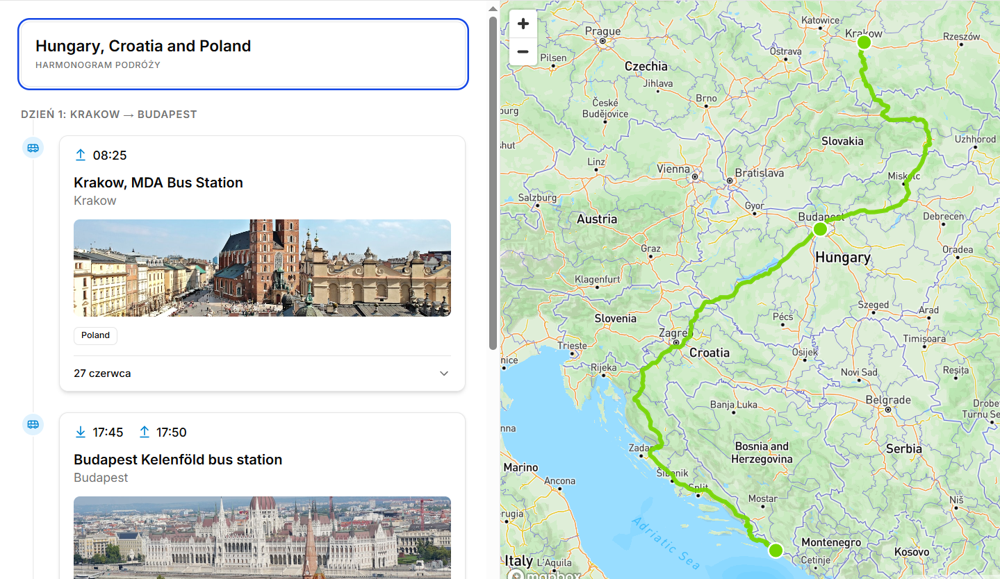

# Project structure

This project is an app that supports creating roadtrips based on your origin using Flixbus Data.
Simply, you select your starting stop and next stops are proposed based on distance and attraction score.
You can add many stops and create trip plans and save them to your account.

# Demo

All endpoints related to authentication, cities, stops, destinations, trips and notes are available on /api/docs



You can follow and check all endpoints if you want

You can register, login or use Google, Github OAuth2



Once logged in, you gain access



You can create new trip and add stops from app or using control panel



And you can add more stops



After that you have nice summary with all important details and you can export it to pdf



# Structure and Data

Data is stored in cloud-based service Supabase with all S3 files (mainly city images)
- React Native - Mobile app is available here: https://github.com/briskly-app/mobile-briskly
- React - Frontend app written by Skiperpol is available here: https://github.com/Skiperpol/frontend-briskly

- GTFS buses schedule for 2026 from flixbus: https://www.transit.land/feeds/f-u-flixbus
- Cities Information: https://download.geonames.org/export/dump/
- Attractions for cities and towns: https://nominatim.org/
- Images: https://pypi.org/project/Wikipedia-API/ and https://unsplash.com/developers

# How to run?

Create environment and install libraries

```
python -m venv venv
source venv\Scripts\activate
pip install -r requirements.txt
```

remember to add .env with corresponding variables, send message to author to receive details

To start django app:

```
python manage.py runserver
```

in case you installed new libraries remember to add them to requirements.txt with:

```
pip freeze > requirements.txt
```

If you make changes in structure of database remember to make migrations

```
python manage.py makemigrations
python manage.py migrate
```

If you want to start seeder command, check them in apps/logistics/management/commands and run
Seeder commands are used to fetch images, descriptions, attractions from external sources like wikipedia or openstreet data

```
python manage.py [command_name] [parameters]
```

You can check all available custom commands by running 'python manage.py help'
